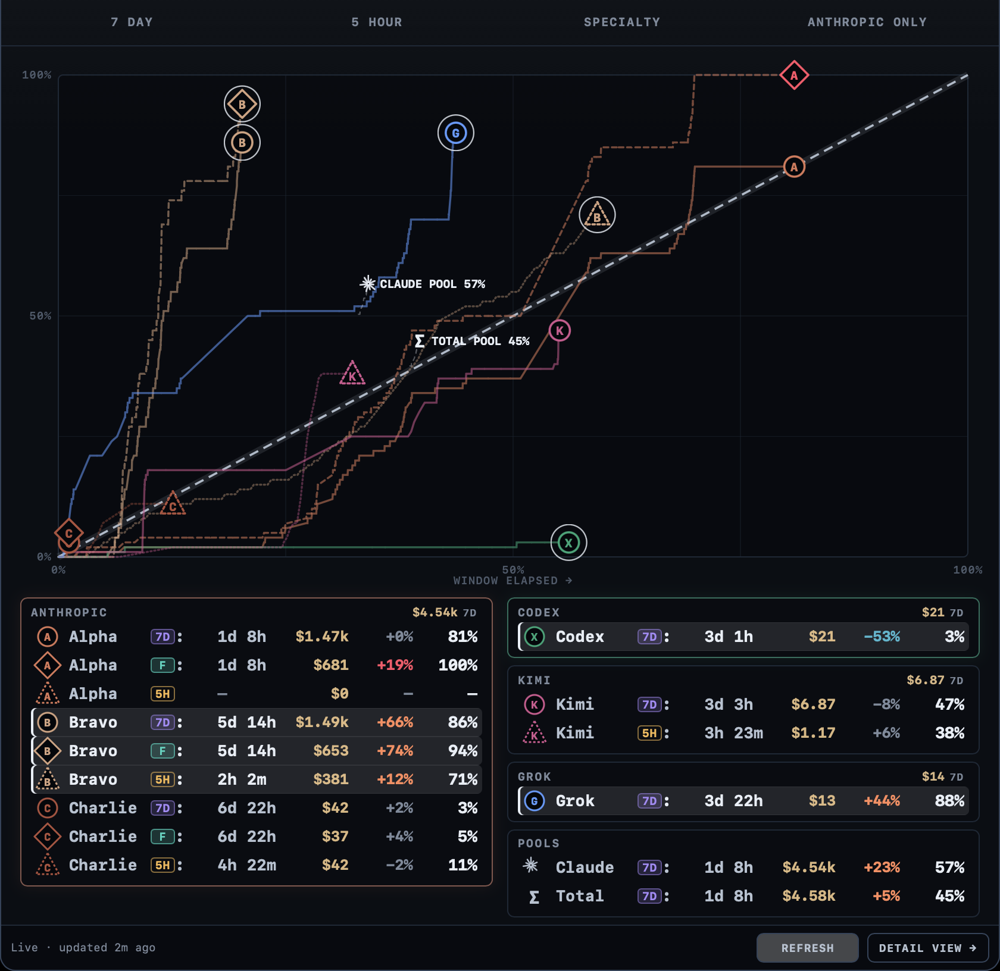
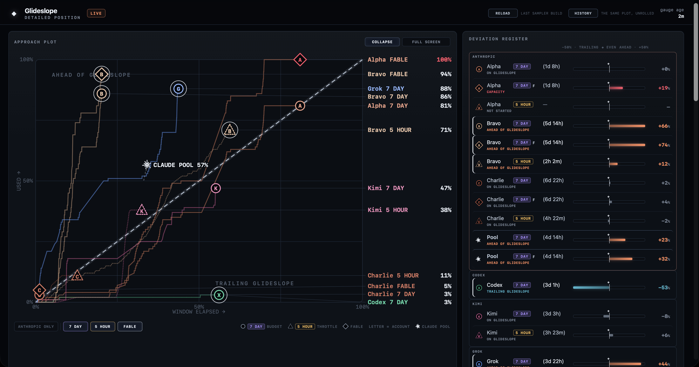
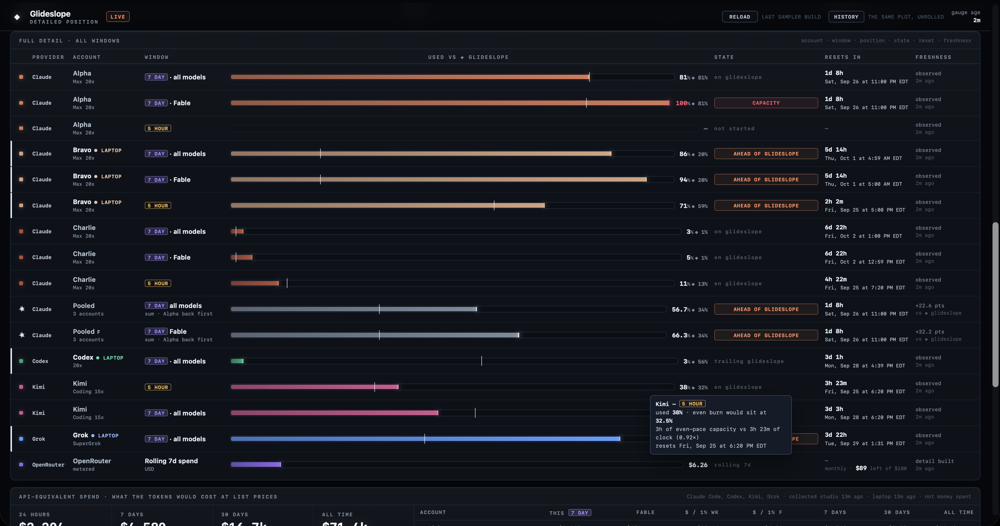

# Glideslope

<p align="center"><b><i>Token subscription optimization for the modern hyperengineer</i></b></p>

<p align="center"></p>
<p align="center"><sub><i>every subscription you hold, on one frame, each against its own clock, 5-hour and 7-day alike. letter = account. shape = window: ○ seven-day · △ five-hour · ◇ Fable · ✳ Claude pool · Σ everything. the dashed beam is even burn, and the register beneath names every marker. a real week of the most valuable resource there is: intelligence.</i></sub></p>

---

listen.

you are running coding agents on many accounts: Claude Max, Codex, Kimi, Grok, because one subscription is nowhere near enough for everything you have in flight. many meters. many reset clocks. many pages, each with its own idea of a percent. you check them in the gaps between the work, and the one answer you actually need, *am I ahead or behind, and can I kick off this large job now?*, is on none of them.

the problem is not the limit. the problem is. position.

### the glide slope.

the name is borrowed from the instrument landing system: the radio beam, flown by an airliner into Pittsburgh through a snowstorm in 1938, that tells a pilot in cloud one thing: above the path to the runway, or below it. the pilot flies the needle, not the ground.

here, the glide slope is the path of optimum usage. you are on the 7-day glide slope if, 3.5 days into a 7-day window, you have used exactly 50% of it. you are ahead of the 5-hour glide slope if, 1 hour into a 5-hour window, you have used 33%, because even burn would have you at 20%. two clocks, one rule: used, against elapsed. so both go on one graph: the x axis is not time, it is *how much of this window has elapsed*, and hour three of a five-hour session sits on the same vertical as day four of a seven-day week. it takes some getting used to. once it clicks, it is the densest picture on your screen, and you will not want the old meters back.

**Glideslope reads every subscription you fly into one interface and puts one mark on every meter: the ◆ glide slope, where an even burn to the reset would have you right now.** above it, you are hot, and you will hit the ceiling early. below it, you are banking capacity that expires at the reset. one comparison, the same in every cell, for every provider, on every window.

most usage tools only warn about the first. on a subscription both sides cost money, so Glideslope treats both as news. capacity does not roll over. at the reset it is gone.

this is built for the hyperengineer flying several subscriptions at once, on purpose, for maximum effect. it asks you to learn one idea and one picture. the idea takes a minute. the picture takes three looks. after that, a single percentage on a single page will feel like flying with one instrument covered.

---

### lineage.

Glideslope was born inside Gregorovich, Atin Woodard's personal infrastructure, where it has flown a multi-account rotation since July 2026. the ◆ mark came first. the plot, the pool, the satellites and the honesty markers each came from a way the instrument turned out to be wrong: a login held on another machine, a stale read presumed fresh, a pool that is only a floor. it will not always be right. it will always say how sure it is.

---

## reading the approach plot.

now the picture. the approach plot puts every window of every account on the same axes.

x is the window: 0% at its start, 100% at its reset. y is what you have used. the dashed beam is y = x, even burn, the glide slope itself. every marker is one window of one account. the letter is the account. the shape is the window: ○ seven-day budget, △ five-hour session, ◇ the weekly Fable meter. behind each marker is its trail, every sample the journal took this window.

above the beam, ahead: the trail is climbing faster than the window is closing, and you will reach 100% before the reset does. below it, banking. the register beside the plot says the same thing as a number: `+66%` is Bravo sixty-six points above its own slope, `−53%` is Codex fifty-three points below it.

**the pool.** if you rotate between Claude accounts, the number you are actually flying is the pool: the mean of the useds against the mean of the phases. both are means of coordinates already on the frame, so the pool lands on the same beam as everything else, as ✳ CLAUDE POOL. Σ TOTAL POOL does it across every subscription you hold. you are not one account. you are many. the pool is the one you fly.

<p align="center"></p>
<p align="center"><sub><i>the Detail view. the same frame with trails, and the key in the row beneath it: ○ 7 DAY budget, △ 5 HOUR throttle, ◇ Fable, letter = account, ✳ Claude pool. on the right, the deviation register: every window's distance from its own slope, as a bar you can read from across the room.</i></sub></p>

### a note on the learning curve.

the plot is not gentle. the first time you look at it you will see a scatter of letters and shapes, and that is your brain refusing to put a five-hour throttle and a seven-day budget on one axis. it is right to refuse. nothing else you use does that.

give it three looks. on the third, the scatter becomes a fleet: which account is hot, which one is banking, which window dies first, where the room is. that read takes under a second once you have it, and it is not available anywhere else. we built the instrument for the operator who will do the work of learning it, and we did not soften it for the one who won't.

## install.

Python 3.11+, standard library only. macOS for the Claude read and the background jobs; the rest is plain Python.

```bash
git clone https://github.com/Stage-11-Agentics/glideslope.git
cd glideslope
python3 glideslope.py                 # the position, in the terminal
python3 glideslope.py --open          # the position, in the browser
bash tools/install-sampler.sh         # every 60s: journal the position, keep the browser tab live
```

or `uv tool install git+https://github.com/Stage-11-Agentics/glideslope` for the `glideslope` and `claude-account` commands alone.

`glideslope` prints the position as relay-ready markdown; `--json` gives the same position as one snapshot. configuration is one optional file, `~/.glideslope/config.toml`, and every key has a default: [`config.example.toml`](config.example.toml).

## seeing it.

two surfaces ship. both are the same position.

- **the terminal.** `glideslope` is the position as a table, and the only terminal interface. `--watch` keeps it redrawing in a pane.
- **the browser.** `glideslope --open` rebuilds the Detail view and opens it as a tab. the page is one self-contained HTML file on disk, nothing hosted, and it reloads itself every minute, so with the sampler installed the tab is a live instrument. `--open popup` is the plot and register alone, `--open history` the same plot on a real clock, weeks stacked behind you.

a menu bar, a side panel, a dashboard cell: not shipped. the popup was drawn for one. it expects a host that embeds it in a web view and rewrites the file every minute, and the sampler already does the rewriting. that wrapper is a short job for your agent, in whatever your platform calls a status item, and we would take the pull request.

<p align="center"></p>
<p align="center"><sub><i>the ledger. every window of every account as a burn clock: used against the ◆ mark, its state, its reset, and how fresh the read is. the footer prices every token at list, never money spent: on the afternoon this page was written the Claude line read $14,885 API-equivalent on $600/mo of plans. 24.8×.</i></sub></p>

## for agents.

the agent is on the same window you are. a skill ships in the repo; install it and Claude Code can ask, mid-task, where it is on usage, and get the position rather than a guess:

```bash
ln -s "$PWD/skills/glideslope" ~/.claude/skills/glideslope
```

> where am I on usage?

developing Glideslope with an agent: [`CLAUDE.md`](CLAUDE.md).

## providers.

| Provider | Meters | Credential |
|---|---|---|
| **Claude** | 5h session, weekly, weekly Fable, per account | the token Claude Code already holds, read-only |
| **Codex** | every native meter plus banked reset credits | none; read through the Codex app-server |
| **Kimi** | plan quota and 5h burst window | a static platform key |
| **Grok** | SuperGrok weekly compute pool | the Grok Build login |
| **OpenRouter** | rolling 7-day dollars (metered, so no slope) | a static API key |

read paths, units, failure modes and the checklist for adding the next one: [`PROVIDERS.md`](PROVIDERS.md). Glideslope holds no credentials and mints no tokens; the promises, as invariants: [`SECURITY.md`](SECURITY.md).

## several Claude logins on one machine.

`claude-account`, shipped here, gives each Claude account its own login home so one machine holds every login at once, and routes new sessions between them:

```bash
claude-account homes              # every login on this machine
claude-account use bravo          # new sessions start as Bravo
claude-account use auto           # let the glide slope pick the account with room
```

running sessions never move, and nothing here stores a token. `claude-account --help` has the rest.

one honest gap: we only jump between Claude accounts, so `claude-account` only knows Claude. multi-account switching for Codex is not built. it is the same shape, one login home per account, and it should be a short job for your agent. we would welcome that pull request.

---

*we believe in the deployment of intelligence. more of it, in more hands, on real work. not waited for. not hoarded. used.*

*the hyperengineer is the one deploying it. we build so that every hour of mind they can reach lands on the work, all of it, and so they can see it landing.*

*as much intelligence deployed as the world can hold, as well as we can manage it. the beautiful future is on the far side of that. not this side.*

*let's build it together.*

---

Glideslope is a [Stage 11 Agentics](https://stage11.ai) project, released under the [MIT license](LICENSE).
